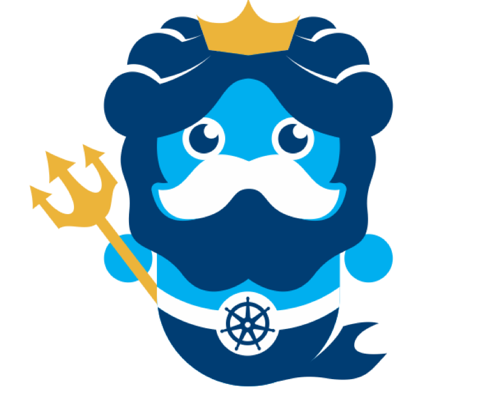

Forked from https://github.com/kubermatic/k8sniff

K8SNIff - tcp ingress controller with SNI support
=====

K8SNIff is a small ingress server that will accept incoming TLS connections and parse
TLS Client Hello messages for the SNI Extension. If one is found, we'll go
ahead and forward that connection to a Kubernetes service with a matching Ingress resource.

sniff config
------------

The following config will K8SNIff listen on port `8443` and listen on Ingress resources

```json
{
    "bind": {
        "host": "localhost",
        "port": 8443
    },
    "kubernetes": {}
}

```
The example ingress connect any requests to `foo` to service `foo` with port `443` and any requests to `bar` to service `bar` with port `443`. If nothing matches this, it will send the traffic to the default backend with the service `bar` on port `443`.

```yaml
apiVersion: extensions/v1beta1
kind: Ingress
metadata:
  name: tcp
  annotations:
    kubernetes.io/ingress.class: k8sniff
spec:
  backend:
    serviceName: bar
    servicePort: 443
  rules:
  - host: foo
    http:
      paths:
      - backend:
          serviceName: foo
          servicePort: 443
  - host: bar
    http:
      paths:
      - backend:
          serviceName: bar
          servicePort: 443
```

The requested domain name are interpreted as regular expressions. Each server and name will be checked in the order they appear in the file, stopping with the first match. If there is no match, then the request is sent to the first server with default `backend` set.

using the parser
----------------

```
import (
    "fmt"

    " kubermatic/k8sniff/parser"
)

func main() {
    listener, err := net.Listen("tcp", "localhost:2222")
    if err != nil {
        return err
    }
}
```
